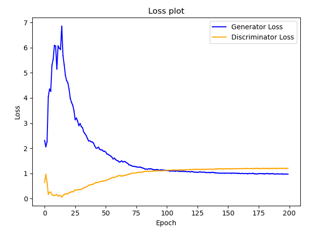

# Vanilla GAN PyTorch

Implement Vanilla GAN architecture using PyTorch.

## Highligts

* The generator and discriminator were implemented in PyTorch, wherein each use
4 linear layers.
* The GAN architecture was trained on MNIST handwriting dataset.
* The generator is fed with 128 dimension noise input and it generates 28x28
grayscale handwriting data consisting of digits.

## Train

* To train the model with the default configurations,
run the command:  `python3 run.py`
* To change the epochs, batch size, patience, run the command with necessary
arguments.  
Example: `python3 --epochs=100 --batch_size=128 patience=10`
* After training, the generator model and discriminator model with the best loss
 will be saved at ./checkpoints/generator.pt and ./checkpoints/discriminator.pt
 respectively.
* Sample generated images and loss plots of training are stored in the folder
./results/

## Results

* The model converged around 100 epochs, generating adeqaute images resembling
the original dataset.
* The loss plot during the training phase is as follows:  

* Generation of images over the epochs can be visualized as:  
